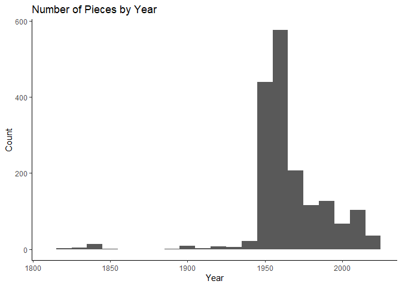

Lab 08 - University of Edinburgh Art Collection
================
Insert your name here
Insert date here

## Load Packages and Data

First, let’s load the necessary packages:

``` r
library(tidyverse) 
```

    ## Warning: package 'tidyverse' was built under R version 4.4.3

    ## Warning: package 'purrr' was built under R version 4.4.3

``` r
library(skimr)
```

    ## Warning: package 'skimr' was built under R version 4.4.3

Now, load the dataset. If your data isn’t ready yet, you can leave
`eval = FALSE` for now and update it when needed.

``` r
# Remove eval = FALSE or set it to TRUE once data is ready to be loaded
uoe_art <- read_csv("data/uoe-art.csv")
```

## Exercise 9

Let’s start working with the **title** column by separating the title
and the date:

``` r
uoe_art <- uoe_art %>%
  separate(title, into = c("title", "date"), sep = "\\(") %>%
  mutate(year = str_remove(date, "\\)") %>% as.numeric()) %>%
  select(title, artist, year, link)  # Fill in the missing variable!
```

    ## Warning: Expected 2 pieces. Additional pieces discarded in 48 rows [144, 236, 252, 343,
    ## 360, 618, 914, 925, 956, 1008, 1144, 1155, 1260, 1360, 1364, 1380, 1405, 1462,
    ## 1474, 1492, ...].

    ## Warning: Expected 2 pieces. Missing pieces filled with `NA` in 696 rows [8, 17, 21, 22,
    ## 24, 26, 41, 44, 48, 50, 52, 57, 66, 67, 69, 70, 76, 78, 80, 83, ...].

    ## Warning: There was 1 warning in `mutate()`.
    ## ℹ In argument: `year = str_remove(date, "\\)") %>% as.numeric()`.
    ## Caused by warning in `str_remove(date, "\\)") %>% as.numeric()`:
    ## ! NAs introduced by coercion

Make sure to replace `___` with the appropriate column name.

## Exercise 10

I think the warnings are from where the date is not simply a four digit
number. Some of them have “circa” or a range of dates which may mess up
the function. This is fine considering our goal is to capture the year
when convenient.

## Exercise 11

``` r
skim(uoe_art)
```

|                                                  |         |
|:-------------------------------------------------|:--------|
| Name                                             | uoe_art |
| Number of rows                                   | 3312    |
| Number of columns                                | 4       |
| \_\_\_\_\_\_\_\_\_\_\_\_\_\_\_\_\_\_\_\_\_\_\_   |         |
| Column type frequency:                           |         |
| character                                        | 3       |
| numeric                                          | 1       |
| \_\_\_\_\_\_\_\_\_\_\_\_\_\_\_\_\_\_\_\_\_\_\_\_ |         |
| Group variables                                  | None    |

Data summary

**Variable type: character**

| skim_variable | n_missing | complete_rate | min | max | empty | n_unique | whitespace |
|:--------------|----------:|--------------:|----:|----:|------:|---------:|-----------:|
| title         |         0 |          1.00 |   0 |  95 |     5 |     1629 |          0 |
| artist        |       111 |          0.97 |   2 |  55 |     0 |     1198 |          0 |
| link          |         0 |          1.00 |  28 |  31 |     0 |     3312 |          0 |

**Variable type: numeric**

| skim_variable | n_missing | complete_rate |    mean |    sd |  p0 |  p25 |  p50 |  p75 | p100 | hist  |
|:--------------|----------:|--------------:|--------:|------:|----:|-----:|-----:|-----:|-----:|:------|
| year          |      1575 |          0.52 | 1964.56 | 53.14 |   2 | 1953 | 1962 | 1977 | 2020 | ▁▁▁▁▇ |

there are 111 pieces of artist info missing. There are 1575 years
missing

## Exercise 12

histogram of year

``` r
uoe_art %>%
  ggplot(aes(year)) +
  geom_histogram(
    binwidth = 10)+
  labs(title = "Number of Pieces by Year",
       x = "Year",
       y = "Count")+
  scale_x_continuous(limits = c(1810, 2025, by = 100))+
  theme_classic()
```

    ## Warning: Removed 1576 rows containing non-finite outside the scale range
    ## (`stat_bin()`).

    ## Warning: Removed 1 row containing missing values or values outside the scale range
    ## (`geom_bar()`).

<!-- -->

### Exercise 13

the most out-of-ordinary year is 2 (i cut it out of the histogram
because it ruined the x axis scale) but thats becayse it was labeled as
Death Mask (2) (1964) so our function pulled the 2 rather than the 1964.

To correct this

``` r
uoe_art <- uoe_art %>%
  mutate(year = if_else(title == "Death Mask", 1964, year))
```

### Exercise 14

``` r
uoe_art %>%
  count(artist, sort = TRUE)
```

    ## # A tibble: 1,199 × 2
    ##    artist               n
    ##    <chr>            <int>
    ##  1 Unknown            373
    ##  2 Emma Gillies       175
    ##  3 <NA>               111
    ##  4 Ann F Ward          23
    ##  5 John Bellany        22
    ##  6 Zygmunt Bukowski    21
    ##  7 Boris Bućan         17
    ##  8 Marjorie Wallace    17
    ##  9 Gordon Bryce        16
    ## 10 William Gillon      16
    ## # ℹ 1,189 more rows

The most commonly featured artist is Emma Gillies. This might be because
she lived in near Edinburgh but also because her brother was a director
at the college. \### Exercise 15

``` r
uoe_art %>%
  filter(str_detect(title, "Child")) %>%
  count()
```

    ## # A tibble: 1 × 1
    ##       n
    ##   <int>
    ## 1    11

I got 11 titles that have the word “Child”. I also checked “child”
(lowercase) but didn’t find any.
